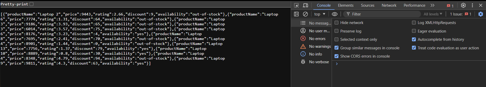
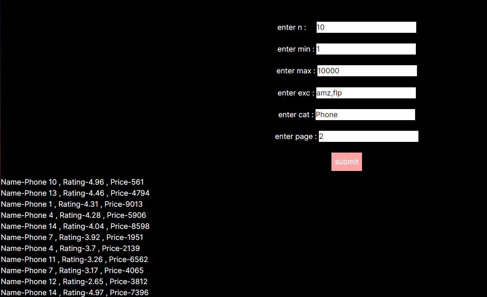

### question 2 is question 1
### question 3 is question 2

### The above is because of some bug in my laptop

# details of question 1

- To make it run download install them independently using <code> npm install </code>
- The api has to be used using the following procedure
<code>http://localhost:3000/api/categories/Laptop/products?n=20&page=2&min=6000&ex_cmp=amz,flp</code>

# details of question 2

- due to time limitations i am asking things like pagination as inputs
- UIs for those can be easily added

